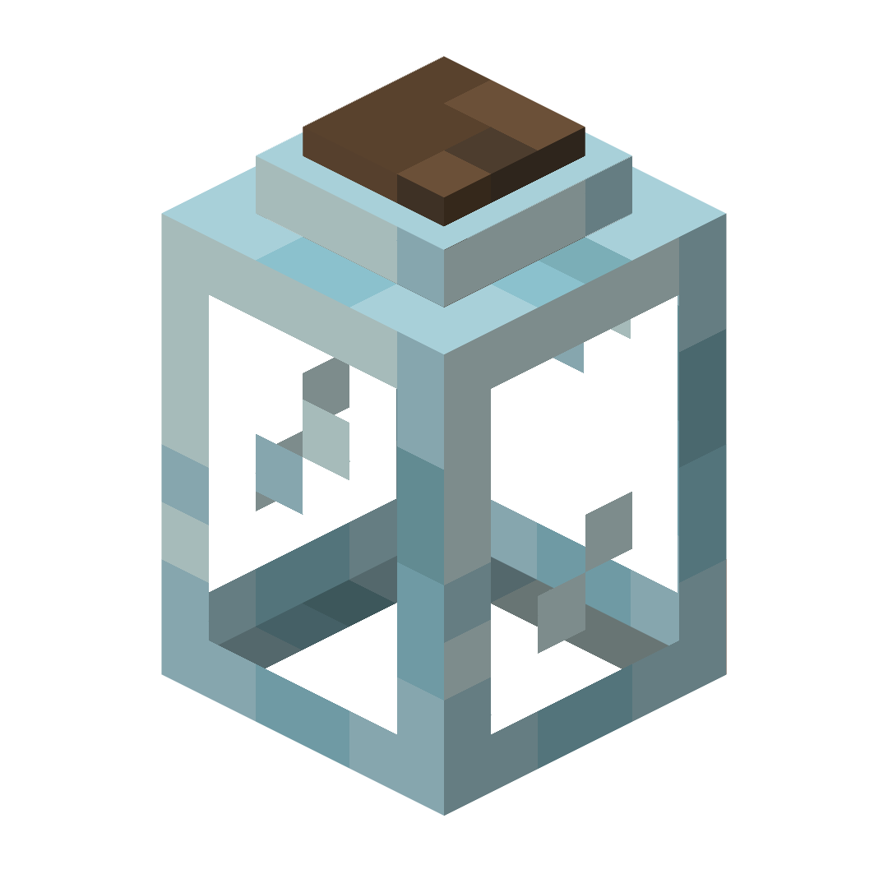
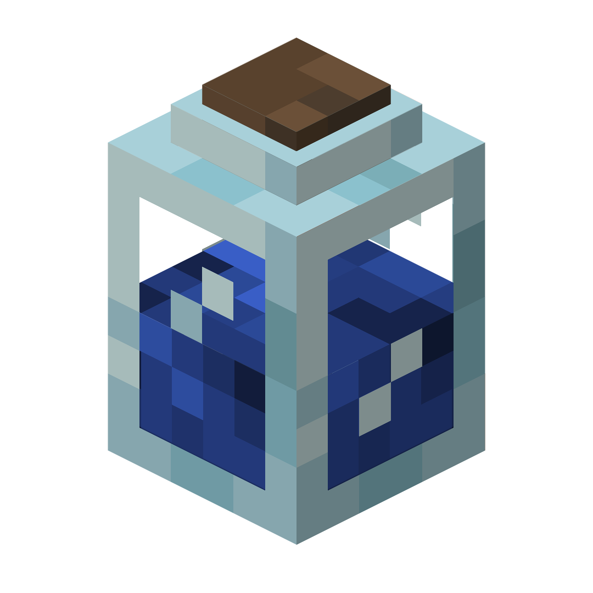
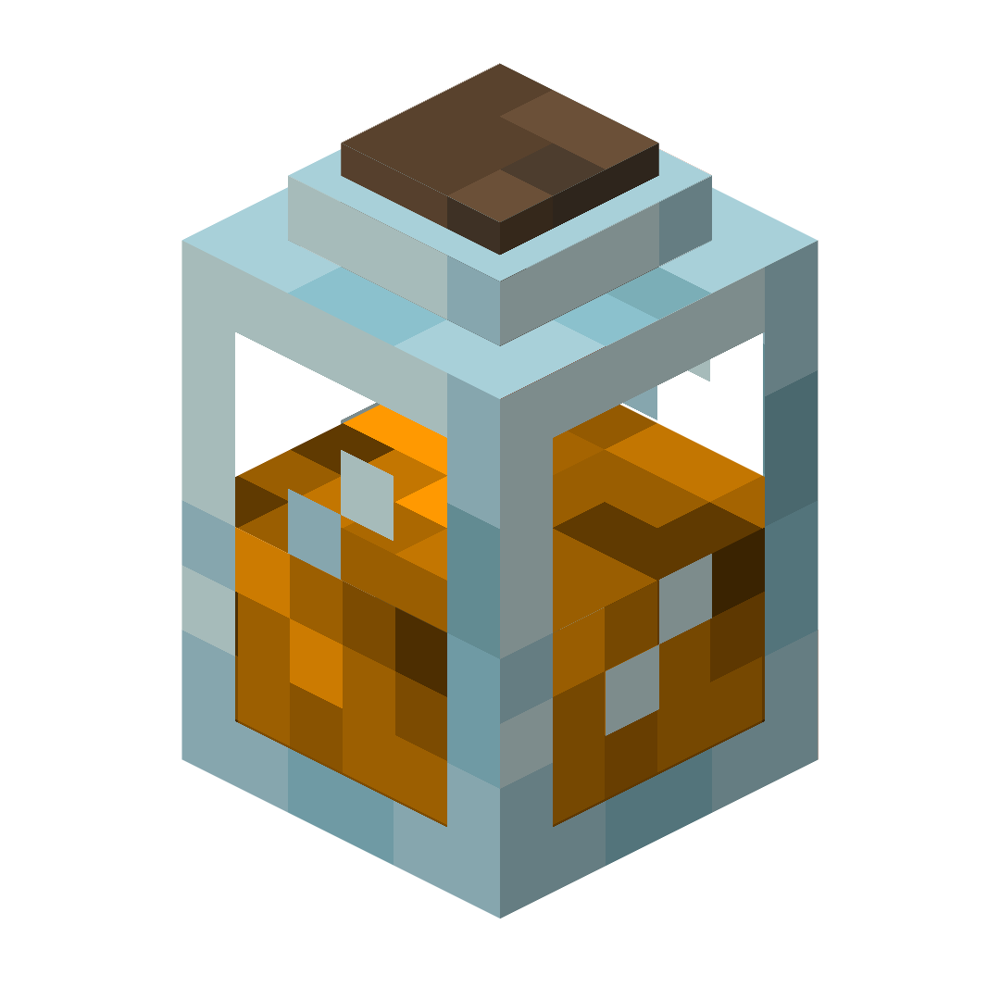
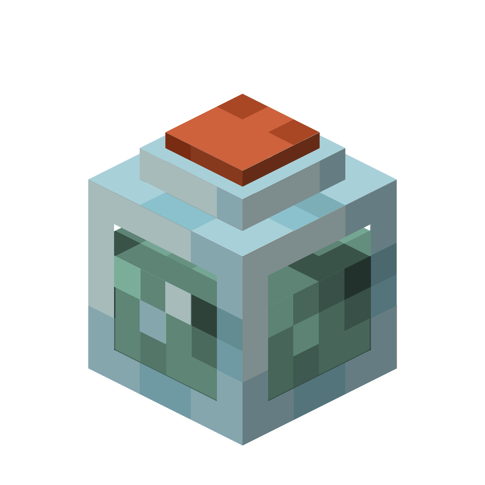
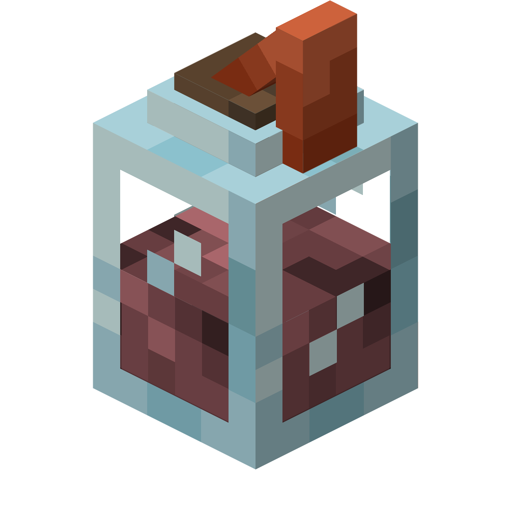
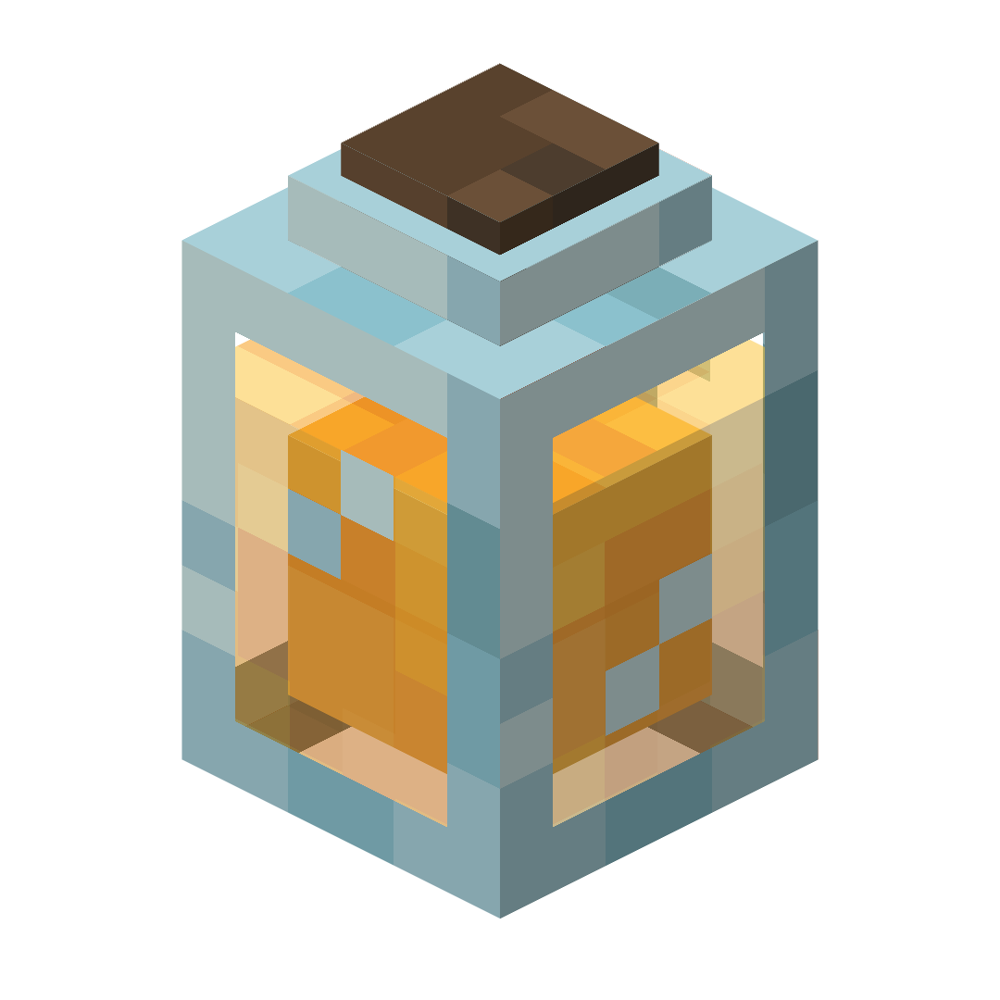
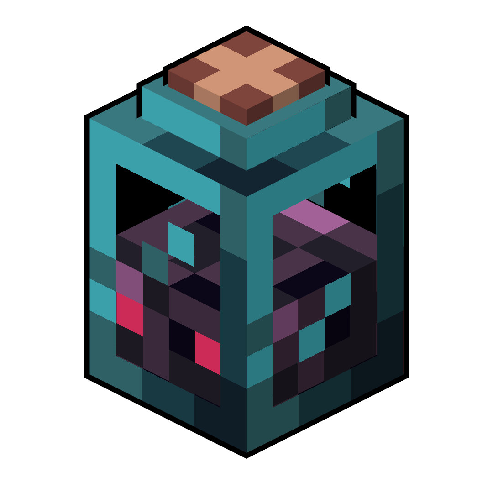
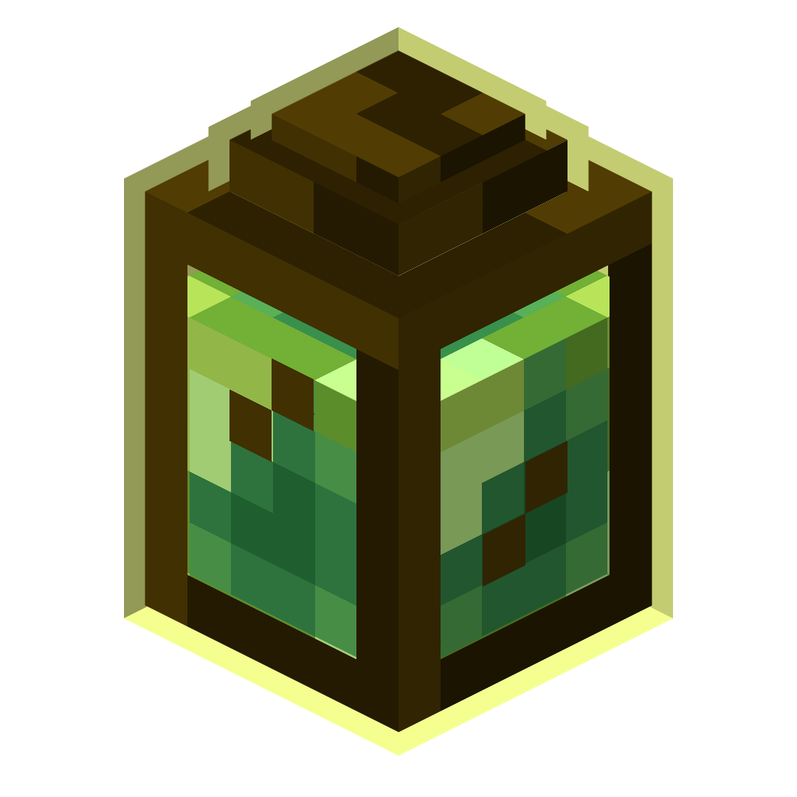

---

#### Rustic's Bottles retextures the bottles and bottle-like items in Minecraft to be 3D!

---

#### this includes: 
 - Glass Bottle

 - Water Bottle
   
 
 
 - Potions (Should also work with most modded potions)

 
 
 - Dragon's Breath

 - Honey Bottle

 - Ominous Bottle

 - Experience Bottle

 ---

 #### Links:
 - Curseforge: [Rustic's Bottles](https://www.curseforge.com/minecraft/texture-packs/rusticsbottles)

---

