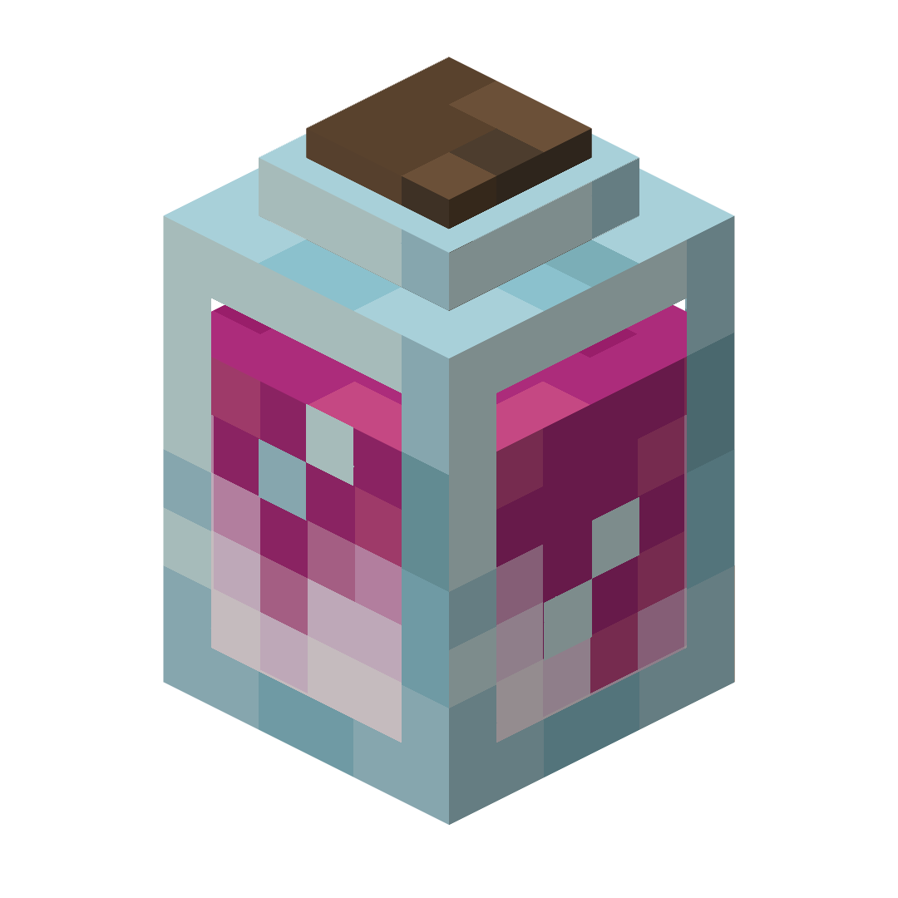

---

---
#### Rustic's Bottles retextures the bottles and bottle-like items in Minecraft to be 3D!

All of the potions, and every item that contains a bottle in minecraft are now 3D. The custom model is also shown when a splash potion or bottle o' enchanting is thrown in the air. making it so the old texture won't be seen. In addition, modded potions should be able to show up with the correct color.

  
 List of every item included:

 - Glass Bottle

 - Water Bottle
   
 
 
 - Potions (Should also work with most modded potions)

 
 
 - Dragon's Breath

 - Honey Bottle

 - Ominous Bottle

 - Experience Bottle

 ---

 #### If you encounter any bugs or have a suggestion, please report it on my [Github page](https://github.com/Rustic-Potatoes/rusticsbottles/).

If you like this pack, try my other resource pack, [Rustic's Books](https://github.com/Rustic-Potatoes/rusticsbooks).

---

 #### Links:
 - Curseforge: [Rustic's Bottles](https://www.curseforge.com/minecraft/texture-packs/rusticsbottles)

---

